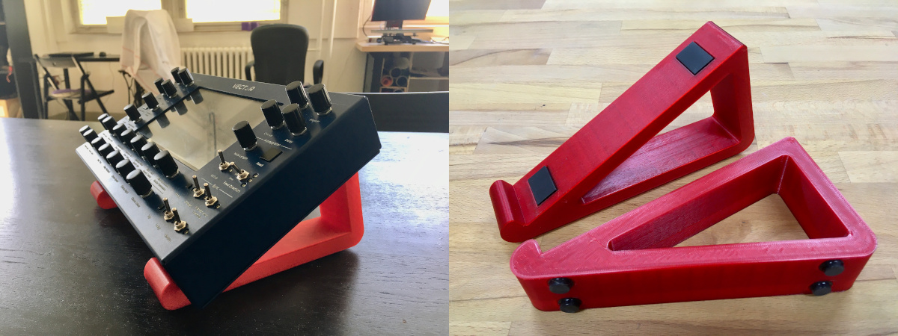
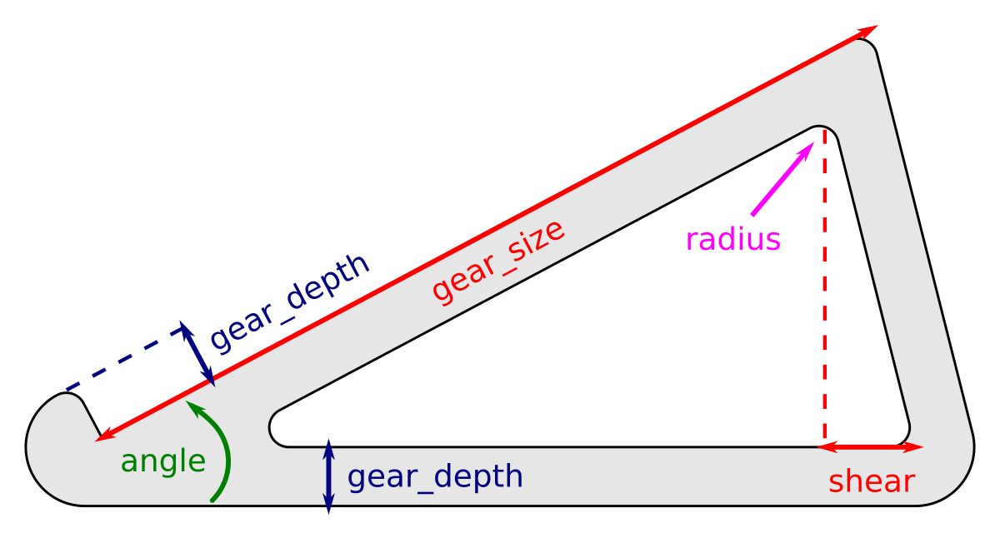

# Parametric 3D-printed gear stand

This is a simple parametric gear stand designed for 3D printing in [OpenSCAD].
It was originally designed for the [Vector synthesizer] but can be used for any
other gear after changing the parameters.

The stand consists of two identical parts. When printed wide enough with the
proposed rubber feet, the two parts are pressed down by the weight of the
instrument so it does not need any connection between the parts as seen in
similar designs (threaded rods etc.).



## Basic parameters

The default parameters are suitable for the [Vector synthesizer].
All dimensions are in millimetres, angles in degrees.

- **stand_width** defines the width of the stand. Use a sufficiently large value.
- **angle** defines the inclination.
- **gear_size** defines the body depth of the gear used.
- **gear_size** defines the size of the front bump (or how "deep" in the stand
  the gear will sit) and also affects the size of the internal cut-out.
- **shear** defines the difference from a right-angled triangle.
- **radius** defines the radii of the internal cut-out.



Moreover, it is possible to configure the placement and geometry of the rubber
feet used.

When tweaking with the parameters, it is possible to reduce the `$fn` variable
at the top of the file to speed up rendering.
It is also possible to export a 2D version of the stand using `stand_2d()` for
manufacturing by other means or for checking the dimensions in a 2D CAD program.

## BOM

Components used for one part (two needed in total):

- 2× Anti-slip rubber (25×12mm): Fix & Fasten FIX-SF-152530
- 4× Bottom rubber feet (diameter 12.7mm): 3M Bumpon series SJ5012 (7000001884)

## Dependencies

The model is using function `round2d()` from the [Round-Anything] library which
is included as a git submodule. To initialize it, run:

```
git submodule update --init
```

## License

The gear stand is free software: you can redistribute it and/or modify it under
the terms of the GNU General Public License as published by the Free Software
Foundation, either version 3 of the License, or (at your option) any later
version.

See file `COPYING` for details.

[OpenSCAD]: https://www.openscad.org/
[Vector synthesizer]: https://www.vectorsynth.com/
[Round-Anything]: https://github.com/Irev-Dev/Round-Anything/
